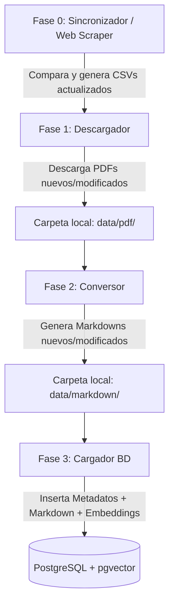
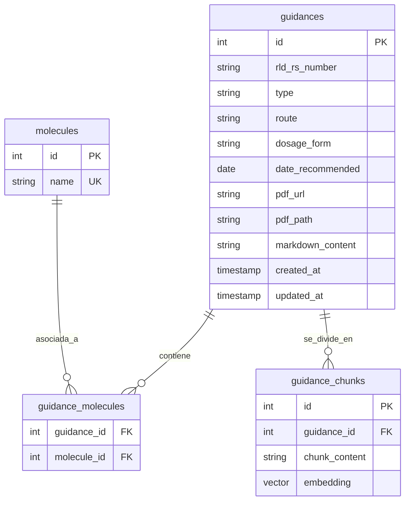

# Agente de Búsqueda de Guías Específicas por Producto (FDA PSG)

Este proyecto tiene como objetivo diseñar e implementar un sistema automatizado para descargar, procesar y almacenar las Guías Específicas por Producto (Product-Specific Guidances - PSG) publicadas por la FDA. La información procesada se estructurará en una base de datos relacional PostgreSQL con capacidades vectoriales (`pgvector`) para servir como base de conocimiento en un sistema de Generación Aumentada por Recuperación (RAG) para un agente de Inteligencia Artificial.

---

## 1. Arquitectura General del Sistema

El flujo de trabajo está diseñado en fases desacopladas y secuenciales para asegurar la modularidad y resiliencia en un entorno de servidor (VPS):

### Fase 0: Sincronizador / Web Scraper (`sync_metadata.py`)
* Se ejecuta de forma periódica (cronjob) para consultar la web de la FDA (ya sea por letras A-Z o consultando las tablas de cambios recientes).
* Compara los registros de la web con los metadatos almacenados en la base de datos PostgreSQL.
* Identifica:
  * Nuevas guías publicadas.
  * Guías existentes que han sido actualizadas (revisadas) o cuyas fechas de recomendación cambiaron.
* Genera los CSVs o listas de trabajo con los cambios detectados para las siguientes fases.

### Fase 1: Descarga de PDFs (`download_pdfs.py`)
* Recibe la lista de guías a procesar (nuevas o actualizadas).
* Descarga el archivo `.pdf` correspondiente desde la FDA si no está en la caché local o si se detecta que cambió.
* Aplica pausas de cortesía entre descargas para evitar bloqueos por límite de peticiones (*rate limiting*).

### Fase 2: Conversión a Markdown (`convert_pdfs.py`)
* Toma únicamente los archivos `.pdf` nuevos o actualizados.
* Extrae el texto estructurando correctamente los párrafos y las tablas de bioequivalencia (BE) en formato Markdown.
* Guarda los resultados en archivos `.md` en la carpeta local (`data/markdown/`).

### Fase 3: Población e Indexación de Base de Datos (`populate_db.py`)
* Asocia cada registro procesado con su correspondiente archivo `.md`.
* Genera los embeddings vectoriales para los fragmentos (chunks) del texto modificado.
* Inserta o actualiza la información correspondiente en PostgreSQL, asegurando que las relaciones de ingredientes activos queden actualizadas.

---

## 2. Diseño de Base de Datos (PostgreSQL)

Para permitir búsquedas precisas tanto relacionales como semánticas, proponemos la utilización de PostgreSQL con la extensión `pgvector` y el siguiente esquema de tablas:

### Detalle de Tablas

1. **`molecules`**: Catálogo único de principios activos (ej. "Amlodipine Besylate"). Esto soluciona búsquedas complejas cuando una guía contiene mezclas de múltiples moléculas.
2. **`guidances`**: Contiene la información principal de la guía, metadatos y el texto completo en Markdown (`markdown_content`). Almacena tanto la `pdf_url` (fuente original FDA) como el `pdf_path` (archivo local en el VPS).
3. **`guidance_molecules`**: Tabla intermedia muchos a muchos que mapea qué moléculas individuales pertenecen a qué guía específica.
4. **`guidance_chunks`**: Contiene los fragmentos indexados del texto para RAG, con su correspondiente columna de vector de embeddings (`embedding`).

---

## 3. Estrategia RAG y Búsqueda Híbrida

Para maximizar la precisión de las respuestas del Agente de IA y evitar alucinaciones, implementaremos una **Búsqueda Híbrida**:

1. **Filtro Estructurado (Metadatos):** 
   El agente puede filtrar primero por campos específicos como el principio activo (`molecule`), la vía de administración (`route`), o el tipo de guía (`type`).
   * *Ejemplo de consulta:* Buscar guías sobre "Amlodipine" que sean vía "Oral".
2. **Búsqueda Semántica Acotada:**
   Una vez obtenidos los IDs de las guías filtradas en el paso anterior, se realiza la búsqueda por similitud vectorial (usando `pgvector`) **únicamente** sobre los registros de `guidance_chunks` asociados a esas guías.

Esto reduce drásticamente el ruido de contexto y ahorra tokens al enviar solo fragmentos relevantes del documento correcto.

---

## 4. Sincronización Periódica (Detección de Cambios)

Una vez realizada la carga inicial en el VPS, se ejecutará un cronjob periódico que realizará lo siguiente de forma eficiente:

1. Volver a descargar los metadatos (ej. volviendo a procesar la búsqueda por letras).
2. Comparar el registro de cada guía contra la base de datos local usando la clave única (`rld_rs_number` + `dosage_form` + `route`).
3. Si la guía es nueva o si la fecha de recomendación cambió:
   * Descargar el PDF.
   * Si la guía ya existía, calcular el hash del nuevo PDF para ver si realmente hay cambios en el texto antes de re-convertir a Markdown.
   * Actualizar metadatos, contenido Markdown y regenerar embeddings en la base de datos.
